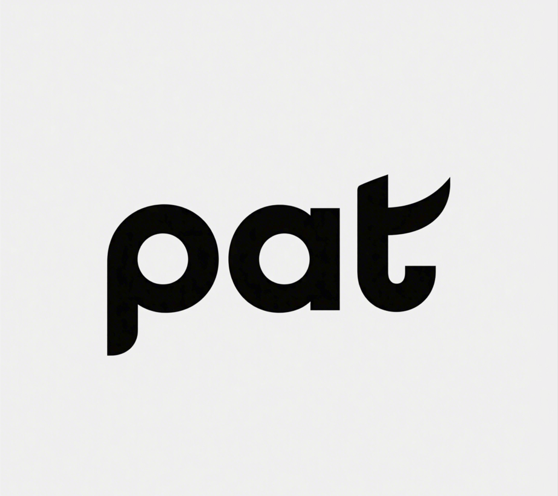

# pat(pdf advanced translator)用户手册
## 用法
1. 建议选择全英文献进行翻译。
2. 当前版本（1.0）调用的是开发者个人的百度翻译开放平台的API，每月一共可翻译100万字符，所以请节约使用。
3. 本产品仅供学习交流，请务用于商业用途。
## 联系开发者
1. 产品官网：[官网](https://www.qi-1940.top)
2. 开发者邮箱：1940402842@qq.com